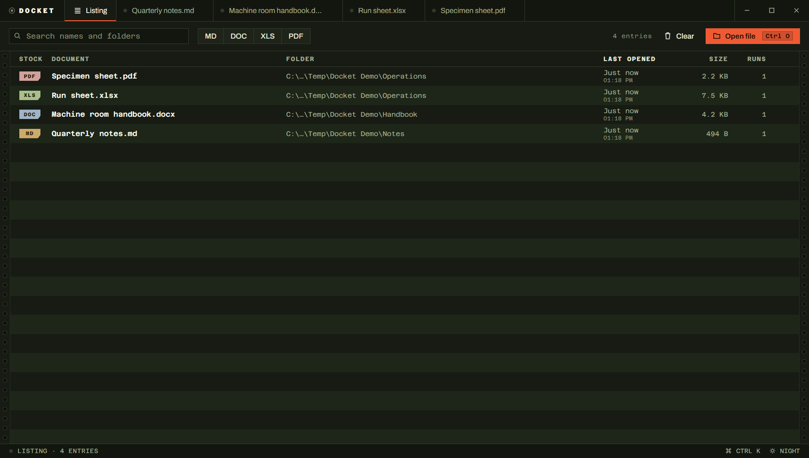
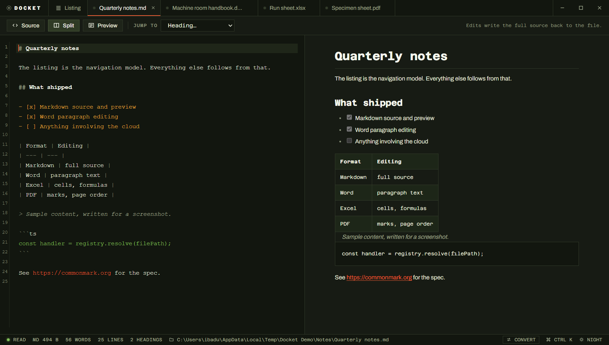
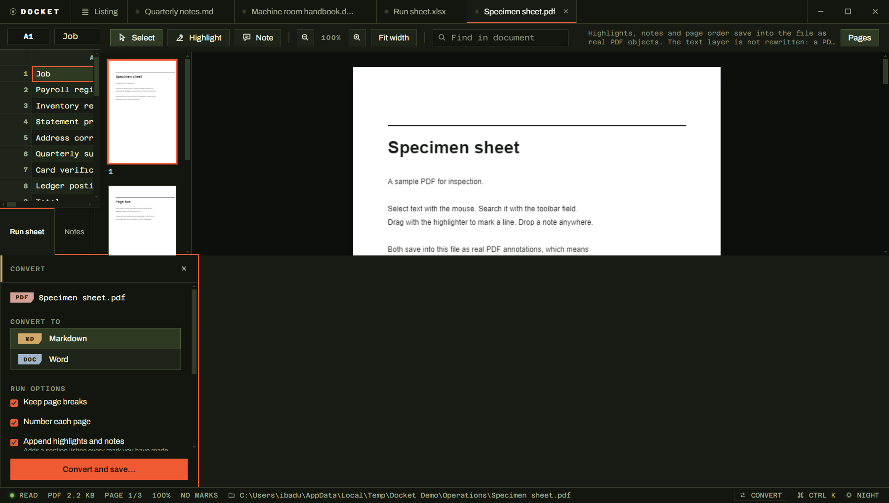
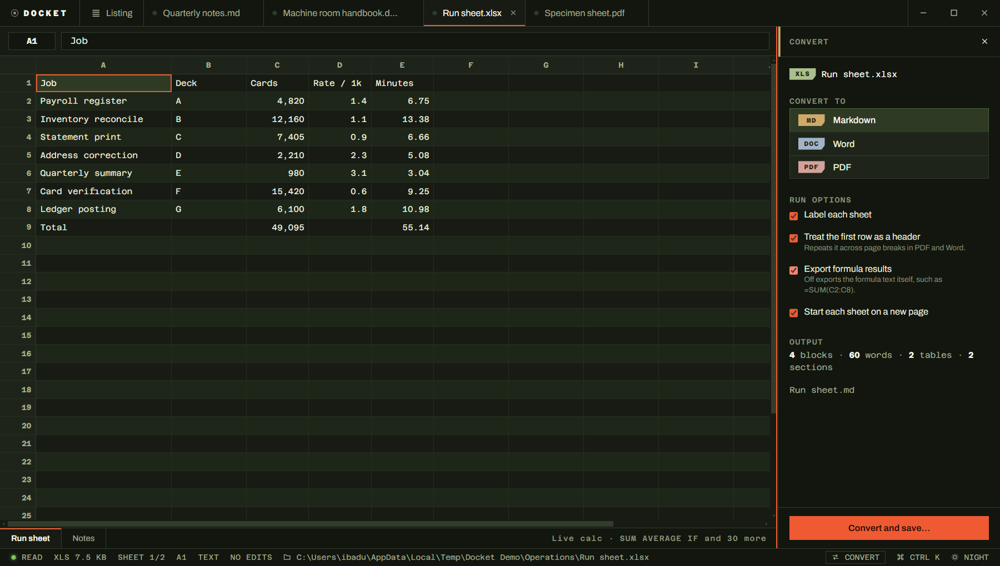
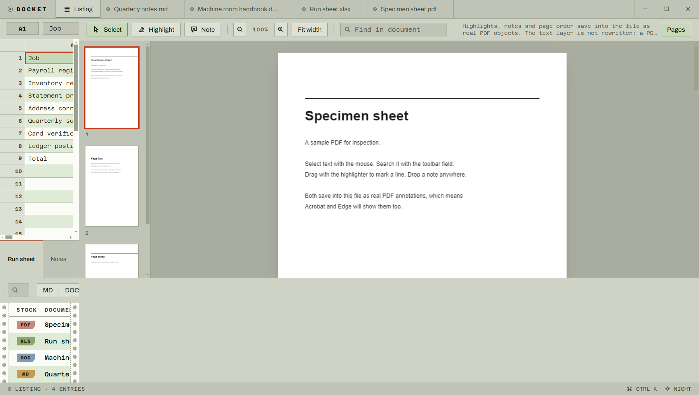

# Docket

**One Windows desktop application that opens, reads, edits, saves and converts
Markdown, Word, Excel and PDF** — with a persistent record of every document you
have opened as its home screen.

<br clear="left">



The record is the navigation model. There is no folder tree, because the way
back to a document is almost always *when you last had it open*, not where it
sits on disk. Each entry keeps the file name, the full folder path, the format,
the size, how many times you have opened it, and the exact moment of the last
open.

Everything is local. No account, no network calls, no telemetry.

| | |
|---|---|
| **Reads and edits** | `.md` `.markdown` `.mdown` `.mkd` · `.docx` · `.xlsx` `.xlsm` · `.pdf` |
| **Converts to** | Markdown · Word · PDF |
| **Ships as** | An NSIS installer and a single-file portable `.exe` |
| **Stack** | Electron · React · TypeScript · SQLite (WASM) |

## Build it

```bash
npm install
```

```bash
npm run dist
```

That produces two files in `release/`:

| File | What it is |
|---|---|
| `Docket-1.0.0-x64.exe` | NSIS installer — per-user, choose your own directory, offers file associations |
| `Docket-1.0.0-portable.exe` | Single-file portable build, no installation |

To run from source without packaging:

```bash
npm run dev
```

## What each format can do

| Format | Reading | Editing | Saves back |
|---|---|---|---|
| **Markdown** `.md .markdown .mdown .mkd` | CodeMirror source editor, live GFM preview, tables, task lists, fenced code, heading outline | Full source | Yes |
| **Word** `.docx` | Faithful rendered view plus an addressable paragraph outline | Paragraph text, keeping paragraph style | Yes |
| **Excel** `.xlsx .xlsm` | Sheet tabs, virtualised grid, number formats, live formula calculation | Cell values and formulas | Yes |
| **PDF** `.pdf` | Paged render, real text selection, find, zoom, page thumbnails | Highlights, notes, page rotate / reorder / delete | Yes |

<table>
<tr>
<td width="50%"></td>
<td width="50%"></td>
</tr>
<tr>
<td>Markdown — source beside a live GFM preview</td>
<td>PDF — page rail, text selection, highlights and notes</td>
</tr>
</table>

## Converting between formats



Any open document converts to **Markdown, Word or PDF** — `Ctrl E`, the
**CONVERT** button in the status line, the command palette, or right-click a row
in the listing and pick *Open and convert…*

|  | → Markdown | → Word | → PDF |
|---|---|---|---|
| **Markdown** | — | ✓ | ✓ |
| **Word** | ✓ | — | ✓ |
| **Excel** | ✓ | ✓ | ✓ |
| **PDF** | ✓ | ✓ | — |

A format never converts to itself; use *Save a copy* (`Ctrl Shift S`) for that,
which copies the real file rather than re-rendering it.

Conversion reads **what is on screen**, including unsaved Markdown text and
unsaved spreadsheet cells. Word and PDF convert from the rendered document, so
if those have unsaved edits the convert panel says so and offers to save first
rather than quietly exporting stale text.

What survives the trip: headings, paragraphs, lists (including nesting and task
checkboxes), tables with alignment, block quotes, code blocks, bold, italic,
strikethrough, inline code and hyperlinks. Word output is a proper package with
a style tree, list numbering and working links — not a wall of directly
formatted runs. PDF output is typeset by Chromium, so it has a real text layer,
selectable text and live links, and is a document rather than a picture of one.

What does not: images, headers and footers, embedded objects, and Excel charts.

**PDF → text is inference, not extraction.** A PDF has no paragraphs, only
glyphs at coordinates. Docket reconstructs structure by grouping runs into
lines by baseline, lines into paragraphs by vertical gap, and promoting
unusually large lines to headings. It works well on ordinary single-column
documents and poorly on multi-column layouts, forms and typeset tables. The
convert panel says this before you run it. A scanned PDF has no text layer at
all, and Docket tells you so rather than producing an empty file.

### The honest limits

These are deliberate, and the application says so in its own interface rather
than failing quietly:

- **PDF text is not rewritten.** A PDF stores text as glyphs at fixed
  coordinates with no notion of a paragraph. Replacing a word reflows nothing,
  and the usual result is a page that looks subtly wrong everywhere. Marks and
  page order are real edits and save into the file as standard PDF annotation
  objects — Acrobat, Edge and Preview all see them.
- **Word editing replaces a paragraph's text and keeps its paragraph style.**
  Formatting that changes mid-paragraph (one bold word) collapses to the
  paragraph's first run. In exchange, editing works by rewriting only the text
  ranges inside `word/document.xml`, so headers, footers, numbering, styles,
  images, comments and revision marks come out byte-for-byte identical. Most
  tools that "edit" .docx parse it into their own model and write a new file,
  silently losing everything they did not model.
- **Excel formulas are calculated live in the app for display only.** Around
  forty functions are implemented (`SUM`, `AVERAGE`, `IF`, `COUNTIF`, `SUMIF`,
  the text and rounding families, and the arithmetic and comparison operators).
  A formula naming an unimplemented function shows `#NAME?` and the grid falls
  back to the value Excel last stored. On save, the formula text is written
  untouched with `fullCalcOnLoad` set, so **Excel recalculates the whole
  workbook itself** and nothing computed here is ever baked into your file.

## Keyboard

| | |
|---|---|
| `Ctrl` `K` | Command palette — every action, plus search across the listing |
| `Ctrl` `O` | Open a document |
| `Ctrl` `S` | Save |
| `Ctrl` `Shift` `S` | Save a copy |
| `Ctrl` `E` | Convert this document to another format |
| `Ctrl` `L` | Back to the listing |
| `Ctrl` `W` | Close the current document |
| `Ctrl` `Tab` | Next open document |

You can also drag files onto the listing.

## Opening files from Explorer

**Run the installer, not the portable build.** Windows learns about an
application from the registry, and only `Docket-1.0.0-x64.exe` writes those
keys. Launching `Docket.exe` directly — from `release/win-unpacked/` or as the
portable build — registers nothing, which is why Docket will not appear under
*Open with* no matter how many files you have opened with it.

Installing registers, per user:

| Key | What it does |
|---|---|
| `Classes\Docket.md` (and `.docx`, `.xlsx`, `.pdf`) | The type: its name, icon and open command |
| `Classes\.md\OpenWithProgids\Docket.md` | Puts Docket in Explorer's *Open with* list |
| `Classes\Applications\Docket.exe` | Friendly name and supported types |
| `Software\Docket\Capabilities` + `RegisteredApplications` | Makes Docket a first-class entry in **Settings → Default apps** |

Each format gets its own document icon in Explorer, colour-coded to match the
listing's format tabs.

### Becoming the default

Docket registers itself as a *candidate* for these formats. It does not seize
the default, because it cannot: since Windows 8 the `UserChoice` key that
records your default is hash-protected, and any application that writes it
directly gets overridden. Installers that claim otherwise are either lying or
about to be reset by Windows.

Making it the default is therefore one deliberate action, taken once:

- **One format:** right-click a file → *Open with* → *Choose another app* →
  Docket → **Always use this app**.
- **All four at once:** the command palette (`Ctrl K`) has *Make Docket the
  default for .md, .docx, .xlsx and .pdf…*, which opens Windows Settings at
  Docket's own entry. Or go to Settings → Apps → Default apps → Docket.

## Privacy

Everything is local. No account, no network calls, no telemetry. The listing
lives in a SQLite database under `%APPDATA%/Docket/listing.sqlite` and is
populated **only** by files you open in the application — Docket never scans
your drives.

## Architecture

The interesting constraint is that **adding a fifth format must not require
editing any code that already exists.** That drove the shape of everything else.

```
src/
  shared/            Contracts both processes speak. Knows no format names.
    documents.ts       payloads, patches, capabilities, RecentEntry
    portable.ts        the canonical document all conversions pass through
    ipc.ts             channel names + a Result envelope
  main/
    composition.ts     the composition root — the ONLY file naming concretions
    documents/
      DocumentHandler.ts          DocumentReader / DocumentWriter interfaces
      DocumentHandlerRegistry.ts  resolve by extension, build dialog filters
      MarkdownHandler.ts  DocxHandler.ts  XlsxHandler.ts  PdfHandler.ts
      docx/DocxPackage.ts         OOXML text-range surgery
    export/
      DocumentRenderer.ts         renderer interface + registry
      MarkdownRenderer.ts  DocxRenderer.ts  PdfRenderer.ts
      printHtml.ts                the print document Chromium typesets
    recents/
      RecentFilesRepository.ts    storage interface
      SqliteRecentFilesRepository.ts
    services/          DocumentService, RecentFilesService, SampleLibrary
    ipc/router.ts      one guarded envelope per channel
  preload/           the entire surface the renderer may touch
  renderer/
    viewers/registry.ts  the renderer's mirror of the handler registry
    export/registry.ts   one extractor per source format
```

### Conversion: an intermediate, not a matrix

Four sources into three targets is twelve conversions. Writing twelve
converters would mean a fifth format adds seven more. Instead everything routes
through one canonical document (`shared/portable.ts`):

```
markdown ─┐                          ┌─→ MarkdownRenderer → .md
docx ─────┤                          ├─→ DocxRenderer     → .docx
xlsx ─────┼─→ PortableDocument ──────┤
pdf ──────┘   headings, paragraphs,  └─→ PdfRenderer      → .pdf
              lists, tables, code,
              quotes, page breaks
```

Four extractors plus three renderers cover all twelve paths, and a fifth format
costs exactly one extractor and one renderer no matter how many already exist.
The model is deliberately the *intersection* of what the four formats can
honestly express, not the union — anything richer would promise fidelity the
renderers cannot keep.

Extractors live in the renderer because that is where the loaded payload, the
user's unsaved draft and pdf.js all are. Renderers live in the main process
because that is where the filesystem and Chromium's `printToPDF` are. The
intermediate is the seam between them, and it travels over IPC as plain data.

### How SOLID actually shows up here

- **Single responsibility.** `DocumentService` knows that opening a document
  and remembering it are two different jobs; it orchestrates a reader and a
  repository and owns neither. `RecentFilesService` only reads and curates —
  writing new entries belongs to opening a file, so it lives elsewhere.
- **Open/closed.** `DocumentHandlerRegistry`, `ViewerRegistry`,
  `DocumentExtractorRegistry` and `DocumentRendererRegistry` are the seams. A
  fifth format is one handler, one viewer, one extractor, one renderer, and one
  `.register(...)` line for each — nothing already written is edited. No
  `switch` on format type exists anywhere in the codebase.
- **Liskov.** Every handler honours the same contract: read returns a payload,
  write either produces a fully valid file of that format or throws. No handler
  signals "unsupported" by returning something odd.
- **Interface segregation.** Reading and writing are separate interfaces.
  A read-only format is not forced to stub a `write` that throws — the registry
  asks `isWritable(handler)` instead of calling and catching. The same applies
  to `FormatCapabilities`, which the UI reads to decide which affordances to
  render, so a surface that accepts a keystroke can always honour it.
- **Dependency inversion.** `DocumentService` depends on
  `RecentFilesRepository`, not on SQLite. Swapping the store is a one-line edit
  in `composition.ts` — which is exactly how this project moved off a native
  SQLite binding when it turned out to need a C++ toolchain to build.

### Security posture

- `contextIsolation: true`, `nodeIntegration: false`. Node stays in the main
  process; the renderer gets the preload API and nothing else.
- A strict CSP in `index.html`; no remote resources, fonts included.
- Markdown and Word HTML are both **sanitised through an allow-list** before
  they touch the DOM — tags, attributes and URL schemes. A `.md` file is
  untrusted input, and so is the HTML extracted from a `.docx` during
  conversion.
- The PDF renderer typesets in an **offscreen, sandboxed window with JavaScript
  disabled**, and only `http(s)`, `mailto`, `tel` and fragment links survive
  into the printed page — a converted document must not be able to smuggle a
  `javascript:` link into a live renderer.
- Conversion refuses to write over the file being converted.
- `will-navigate` and `setWindowOpenHandler` refuse in-place navigation; links
  open in the user's own browser.
- The listing database is flushed through a temp-file rename, which is atomic on
  NTFS: a crash mid-write leaves the previous listing intact.


## Light theme



## Releasing

Versions follow [semantic versioning](https://semver.org) — see
[CHANGELOG.md](CHANGELOG.md) for the rules and the history.

Not every commit gets a version. The version changes when something is
**released** — when installers are built and published for people to download.
A dozen commits can land under one bump.

```bash
npm version patch
```

`patch` for bug fixes only (`1.1.0` → `1.1.1`), `minor` for new functionality
(`1.1.0` → `1.2.0`), `major` for anything that breaks an existing user
(`1.1.0` → `2.0.0`). When a release carries both fixes and features, the larger
bump wins. The command updates `package.json`, commits it and creates a `v` tag.

Then publish it:

1. Add a section at the top of `CHANGELOG.md` — Added / Fixed / Changed.
2. `npm run dist` — artifact names pick up the new version automatically.
3. `git push && git push --tags`
4. On GitHub: **Releases → Draft a new release**, pick the tag, paste the
   changelog section, attach both `.exe` files from `release/`.

Installers are deliberately not committed. A 90 MB binary per version would
bloat the history permanently, and git cannot forget it afterwards. Releases
are where binaries belong.

## Licence

[MIT](LICENSE) © ibadullah Khalid
